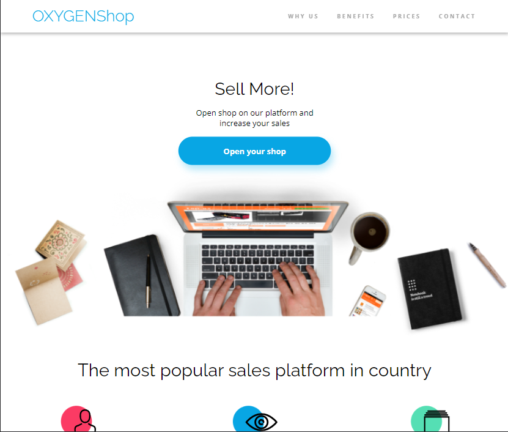
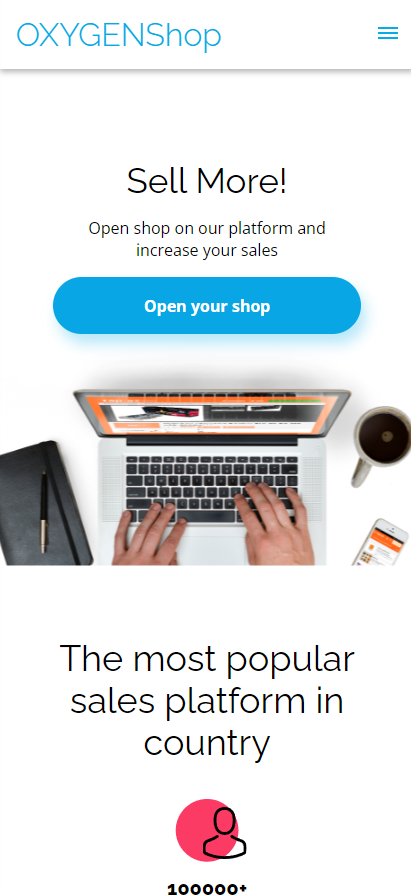

<h1 align="center">Oxygen Shop</h1>

   Solution for the first proyect of the OXYGEN TRAINING

  <h3>
    <a href="https://rickhalmoguera.github.io/Oxygen-Shop/">
      Demo
    </a>
      | 
    <a href="https://rickhalmoguera.github.io/PORTFOLIO/">
      Portfolio
    </a>
  </h3>

<!-- TABLE OF CONTENTS -->

## Table of Contents

- [Overview](#overview)
  - [Built With](#built-with)
- [Features](#features)
- [Contact](#contact)
- [Acknowledgements](#acknowledgements)

## Overview
This is my inaugural project from the Oxygen Training program, crafted using HTML, SASS, and a touch of JS. You will notice that it boasts a responsive layout, with the mobile version being constructed entirely without the use of flexbox or grid – relying solely on "display: block" or "display: inline-block." The desktop version, on the other hand, indeed leveraged Flexbox.
# Desktop Screenshot

# Mobile Screenshot

### Built With

- [HTML](https://developer.mozilla.org/es/docs/Web/HTML)
- [Css](https://developer.mozilla.org/es/docs/Web/CSS)
- [FlexBox](https://css-tricks.com/snippets/css/a-guide-to-flexbox/)

## Features

This site was created as a submission to the Training in [Oxygen Academy](https://oxygenacademy.es/). Where we practice layout design and rectify common errors such as excessive usage of Flexbox and Grid.

## Acknowledgements

- [CSS display Property](https://www.w3schools.com/cssref/pr_class_display.php)
- [A Complete Guide to Flexbox](https://css-tricks.com/snippets/css/a-guide-to-flexbox/)

## Contact

- Website [PORTFOLIO](https://rickhalmoguera.github.io/PORTFOLIO/)
- GitHub [@RickHalmoguera](https://github.com/RickHalmoguera)
